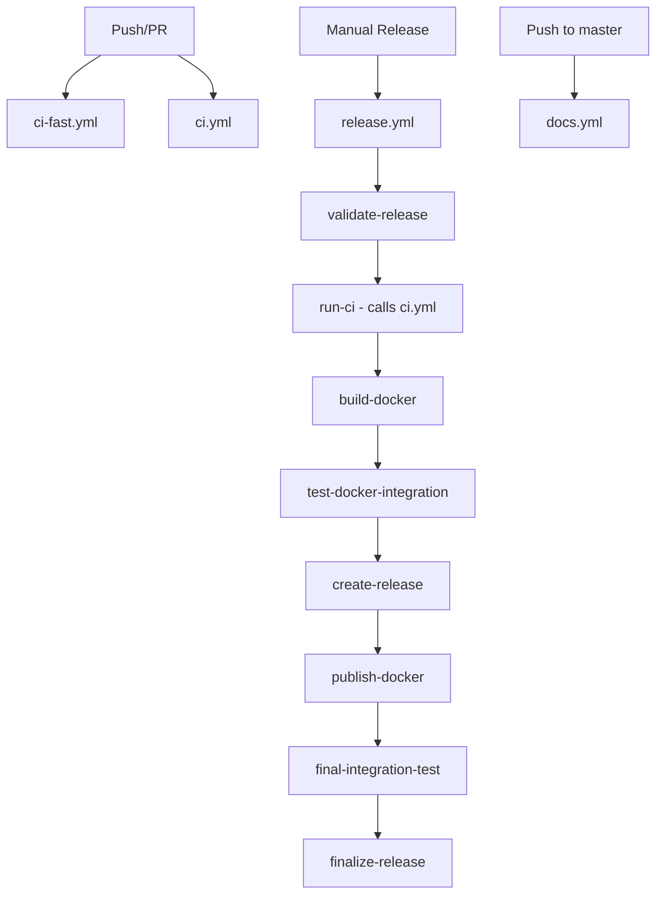

# 🚀 siRNAforge CI/CD Architecture

## Overview
This document describes the restructured CI/CD system for siRNAforge, designed to be efficient, reliable, and maintainable.

## Problems Solved
- **Docker Build Timing**: Docker images now build only after all tests pass
- **Test Redundancy**: Clear separation between quick validation and comprehensive testing
- **Resource Efficiency**: Heavy operations run only when necessary
- **Dependency Management**: Proper workflow dependencies ensure quality gates
- **Release Complexity**: Simplified release process with clear stages

## Workflow Files

### 1. `ci.yml` - Main CI/CD Pipeline
**Triggers**: Push/PR to `master`/`dev`, called by release workflow
**Purpose**: Comprehensive validation and quality assurance
**Runtime**: ~15-25 minutes

**Jobs**:
- **lint-and-format**: Ruff linting, formatting checks, mypy type checking
- **security**: Bandit security scanning, safety vulnerability checks
- **test-matrix**: Python 3.9-3.12 unit/integration tests with coverage
- **build-package**: Build wheel, validate with twine, test installation
- **docs**: Build Sphinx documentation
- **final-status**: Aggregate status for workflow_call usage

**Key Features**:
- Parallel execution for speed
- Comprehensive test coverage
- Proper artifact handling
- Can be called by other workflows

### 2. `release.yml` - Release Management
**Triggers**: Manual (`workflow_dispatch`) only
**Purpose**: Create releases and publish artifacts
**Runtime**: ~30-45 minutes
**Dependencies**: Calls and waits for main CI to pass

**Jobs**:
1. **validate-release**: Input validation, version checks, changelog extraction
2. **run-ci**: Calls `ci.yml` workflow to ensure quality
3. **build-docker**: Build and test Docker images (only after CI passes)
4. **test-docker-integration**: Docker-based integration testing
5. **create-release**: Create GitHub release and Git tag
6. **publish-docker**: Push images to registries
7. **final-integration-test**: Test published artifacts
8. **finalize-release**: Cleanup and summary

**Key Features**:
- Only runs Docker builds after full CI validation
- Proper error handling and cleanup
- Comprehensive Docker testing before publishing
- Clear release notes generation

### 3. `ci-fast.yml` - Quick Validation
**Triggers**: Push/PR to `master`/`dev`, manual
**Purpose**: Fast feedback for development
**Runtime**: ~5-8 minutes

**Jobs**:
- **quick-validation**: Critical syntax checks, unit tests, build validation
- **summary**: Results overview

**Key Features**:
- Minimal resource usage
- Only critical error detection
- Quick feedback loop
- Complements main CI, doesn't replace it

### 4. `docs.yml` - Documentation Deployment
**Triggers**: Push to `master`, manual
**Purpose**: Build and deploy documentation to GitHub Pages
**Runtime**: ~5-10 minutes

**Jobs**:
- **build-docs**: Build Sphinx documentation
- **deploy-docs**: Deploy to GitHub Pages

## Workflow Dependencies



## Usage Patterns

### Development Workflow
1. **Fast feedback**: `ci-fast.yml` runs automatically for quick validation
2. **Comprehensive testing**: `ci.yml` runs automatically for full validation
3. **Documentation**: `docs.yml` updates docs on master branch changes

### Release Workflow
1. **Manual trigger**: Run `release.yml` with version input
2. **Quality gate**: Automatically runs full CI pipeline first
3. **Docker validation**: Builds and tests Docker images only after CI passes
4. **Publishing**: Creates release and publishes artifacts only after all tests pass

## Make Target Integration

The workflows integrate with your Makefile targets:

```bash
# Local development (matches ci-fast.yml)
make check              # lint-fix + test-fast

# Comprehensive validation (matches ci.yml)
make lint test build docs

# Docker operations (used in release.yml)
make docker docker-test-integration
```

## Environment Variables and Secrets

### Required Secrets
- `GITHUB_TOKEN`: Automatic, for GitHub operations
- `CODECOV_TOKEN`: Optional, for coverage reporting

### Optional Secrets
- `DOCKER_USERNAME`/`DOCKER_PASSWORD`: For Docker Hub publishing

### Environment Variables
- `PYTHON_VERSION`: "3.11" (consistent across workflows)
- `REGISTRY`: "ghcr.io" (GitHub Container Registry)

## Benefits of New Architecture

### 🚀 **Performance**
- Fast CI completes in ~8 minutes for quick feedback
- Main CI optimized with parallel jobs
- Docker builds only when needed

### 🛡️ **Reliability**
- Proper dependency chains prevent premature publishing
- Comprehensive testing before releases
- Clear error handling and cleanup

### 🔧 **Maintainability**
- Clear separation of concerns
- Reusable workflow components
- Consistent patterns across files

### 📊 **Observability**
- Clear job names and statuses
- Comprehensive artifact handling
- Detailed logging and error reporting

## Migration Notes

### Breaking Changes
- Old `create-release.yml` and `create-release-new.yml` removed
- Release process now requires manual trigger only
- Docker images build later in the process

### Compatibility
- All existing Make targets still work
- Test markers and categories unchanged
- Python version matrix maintained

## Next Steps

1. **Test the workflows** on a feature branch
2. **Update documentation** if needed
3. **Train team** on new release process
4. **Monitor performance** and adjust timeouts if needed

## Troubleshooting

### Common Issues
- **CI workflow_call errors**: Check that `ci.yml` syntax is valid
- **Docker build failures**: Ensure Docker context and dependencies are correct
- **Release validation failures**: Check version format and Git tag availability
- **Test timeouts**: Adjust timeout values in workflow files

### Debug Commands
```bash
# Test locally what CI does
make check
make test
make build

# Test Docker functionality
make docker
make docker-test-integration

# Validate release readiness
make release
```
