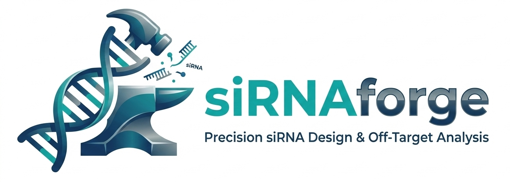

<div align="center">
  

  <h1>siRNAforge</h1>

  [](https://github.com/austin-s-h/sirnaforge/actions/workflows/release.yml)
  [](https://www.python.org/downloads/)
  [](https://github.com/astral-sh/uv)
  [](https://github.com/users/austin-s-h/packages/container/package/sirnaforge)
  [](https://austin-s-h.github.io/sirnaforge)
  [](LICENSE)

  [**Quick Start**](#-quick-start) •
  [**Documentation**](https://austin-s-h.github.io/sirnaforge) •
  [**Examples**](#-usage-examples) •
  [**API Reference**](docs/api_reference.rst)
</div>

---

## 🧬 What is siRNAforge?

**siRNAforge** is a production-ready tool for designing small interfering RNAs (siRNAs) with integrated multi-species off-target analysis. Built for researchers who need reliable, high-specificity gene silencing candidates.

### Why siRNAforge?

- 🎯 **End-to-end workflow** — From gene symbol to ranked candidates in one command
- 🔬 **Multi-species validation** — Off-target analysis of transcriptome and miRNA seed matches across human, rat, and rhesus macaque genomes
- 🐍 **Developer-friendly** — Modern Python API with full type hints and Pydantic models. Easily extend with your own scoring methods.

### Key Features

| Feature | Description |
|---------|-------------|
| **🔍 Multi-database search** | Automatic transcript retrieval from Ensembl, RefSeq (TODO), and GENCODE (TODO) |
| **🧬 Variant targeting** | Design and rank candidates against specific genetic variants with population AF filtering |
| **🧾 Transcript annotations** | Fetch transcript models/interval annotations via a provider layer (Ensembl REST-backed) |
| **🌡️ Thermodynamic scoring** | ViennaRNA-based secondary structure prediction and stability analysis |
| **🎯 Transcriptome Off-target analysis** | Transcriptome BWA-MEM2 `transcriptome` search with mismatch tolerance control |
| **🧬 miRNA seed avoidance** | MirGeneDB, MirBase (TODO) seed-region matching against miRNA databases (positions 2-8; internal `pyahocorasick` default) |
| **🔤 Smart species handling** | Accepts any format (common names, miRBase codes, scientific names) — auto-normalizes to canonical |
| **⚙️ Nextflow pipeline** | Scalable, containerized execution for high-throughput analysis |
| **💉 Chemical modifications** | Track 2'-O-methyl, 2'-fluoro, and phosphorothioate patterns |
| **📊 Rich output** | Structured CSV, FASTA, and JSON reports with comprehensive metadata |

**Supported Python versions:** 3.10, 3.11, 3.12 *(Python 3.13+ pending ViennaRNA compatibility)*

---

## 📦 Installation

Choose your path based on what you need to do:

 **[Complete installation guide with troubleshooting →](docs/getting_started.md)**

- **Deploy / run from registry (no setup)** — Pull the prebuilt image with all bio tools, Nextflow, and Java bundled.
  ```bash
  docker pull ghcr.io/austin-s-h/sirnaforge:latest
  ```

- **Daily development (Python-only, fast)** — Use uv + managed virtualenv; great for core code and unit tests. Heavy bio/Nextflow tests stay skipped unless you also have Docker/Java.
  ```bash
  curl -LsSf https://astral.sh/uv/install.sh | sh
  git clone https://github.com/austin-s-h/sirnaforge && cd sirnaforge
  make dev
  make check
  ```

- **Complete local testing (matches CI)** — Either
  1) Build and test in Docker (reuses the bundled tools): `make docker-build-test`
  2) Or use conda to get bio deps + Java locally, then run the full suite:
  ```bash
  conda env create -f environment-dev.yml
  conda activate sirnaforge
  make test-release
  ```
  (Nextflow/Java are required for Nextflow-marked tests; Docker is required for container-marked tests.)

---

## 🚀 Quick Start

Get your first results in 30 seconds:

```bash
# Docker
docker run -v $(pwd):/workspace -w /workspace \
  ghcr.io/austin-s-h/sirnaforge:latest \
  sirnaforge workflow TP53 --output-dir results

# Local
uv run sirnaforge workflow TP53 --output-dir results
```

**What you get:**
- Transcript sequences from Ensembl
- Thermodynamically-scored siRNA candidates
- Off-target analysis (Docker only)
- Ranked results in CSV and FASTA formats
- Automatic Ensembl transcriptome indexing across human, mouse, rat, and rhesus macaque (override with `--transcriptome-fasta`, or supply design-ready transcripts via `--input-fasta`)
- A `reference_summary` block in `logs/workflow_summary.json` that records whether each reference was explicit, defaulted, or disabled

Need more control? Customize with parameters:

```bash
sirnaforge workflow BRCA1 \
  --genome-species "human,rat,rhesus" \
  --gc-min 40 --gc-max 60 \
  --top-n 50 \
  --design-mode mirna \
  --output-dir results
```

### ZFN mutation constraints (composable)

ZFN mode accepts repeatable mutation constraints so you can combine per-subfinger and global budgets.

```bash
sirnaforge zfn \
  --zfn-left-half-site GCGTGGGCG \
  --zfn-right-half-site GCCCACGCG \
  --zfn-search-space ensembl_human_hg38_primary \
  --zfn-max-mismatches-per-subfinger 1 \
  --zfn-max-substitutions-overall 3 \
  --zfn-subfinger-mutation "2:0:deletion" \
  --output-dir zfn_results
```

Constraint syntax for `--zfn-subfinger-mutation` is:

- `scope:max_mutations:type1,type2`
- `scope` can be:
  - `*` → default budget for each subfinger
  - `<index>` → specific subfinger (1-based)
  - `overall` → global budget across all subfingers
- supported types: `substitution`, `transition`, `transversion`, `insertion`, `deletion`
- shorthand: `mismatch` is accepted as an alias for `substitution`

### Custom inputs & offline mode

Bring your own transcript sequences while still running the full workflow:

```bash
# Design from bundled sample FASTA (design-only mode, no transcriptome off-target)
sirnaforge workflow TP53 \
  --input-fasta examples/sample_transcripts.fasta \
  --output-dir custom_inputs_demo

# Design from bundled sample FASTA and align against mouse transcriptome
sirnaforge workflow TP53 \
  --input-fasta examples/sample_transcripts.fasta \
  --transcriptome-fasta ensembl_mouse_cdna \
  --output-dir custom_inputs_demo

# Remote FASTA sources also work
sirnaforge workflow BRCA1 \
  --input-fasta https://example.org/custom/brca1.fasta \
  --transcriptome-fasta /data/reference/ensembl_human_cdna_111.fasta
```

`--input-fasta` skips the gene search stage and designs directly from your sequences. When used alone, transcriptome off-target analysis is disabled (design-only mode). To enable transcriptome off-target with custom inputs, explicitly provide `--transcriptome-fasta`.

When `--transcriptome-fasta` is omitted the workflow automatically indexes the bundled Ensembl cDNA transcriptomes for human, mouse, rat, and macaque so multi-species off-target analysis runs out of the box.

Every workflow run now captures the resolved transcriptome decision in `logs/workflow_summary.json` under `reference_summary.transcriptome`, indicating whether the reference was auto-selected, explicitly supplied, or intentionally disabled. This makes it easier to audit production runs and confirm that default references were applied as expected.

📖 **[Usage examples and workflows →](docs/usage_examples.md)**
📖 **[Complete CLI reference →](docs/cli_reference.md)**

---

## 📚 Documentation

<table>
<tr>
<td width="50%">

### 🎯 For Users
- **[Getting Started](docs/getting_started.md)** — Installation, first run, quick reference
- **[Usage Examples](docs/usage_examples.md)** — Real-world workflows and patterns
- **[CLI Reference](docs/cli_reference.md)** — Complete command documentation
- **[Gene Search](docs/gene_search.md)** — Multi-database transcript retrieval
- **[Thermodynamic Guide](docs/thermodynamic_guide.md)** — Scoring algorithms explained

</td>
<td width="50%">

### 🔧 For Developers
- **[API Reference](docs/api_reference.rst)** — Python API documentation
- **[Tutorials](docs/tutorials/)** — Python API, pipelines, custom scoring
- **[Architecture](docs/developer/architecture.md)** — System design and components
- **[Testing Guide](docs/developer/testing_guide.md)** — Running and writing tests
- **[Contributing](CONTRIBUTING.md)** — Development workflow

</td>
</tr>
</table>

📘 **[Browse full documentation →](https://austin-s-h.github.io/sirnaforge)**

Use `sirnaforge --help`, `sirnaforge workflow --help`, or the detailed [`CLI reference`](docs/cli_reference.md).

---

## 🎯 Use Cases

**🧬 Basic Gene Silencing**
```bash
sirnaforge workflow EGFR --output-dir egfr_analysis
```
Design siRNAs for a single target gene with default parameters.

**🔬 Multi-Species Validation**
```bash
# Accepts any species format - auto-normalizes to canonical names
sirnaforge workflow TP53 --species "human,rat,macaque"
# Also works: --species "hsa,rno,mml" or --species "Homo sapiens,Rattus norvegicus,Macaca mulatta"
```
Check off-target potential across multiple model organisms.

**🧪 miRNA Seed Avoidance**
```bash
# Species parameter drives both transcriptome and miRNA analysis
sirnaforge workflow BRCA1 --species "human,mouse"
# Override miRNA species independently if needed: --mirna-species "hsa,mmu,rno"
```
Filter candidates that match microRNA seed regions to reduce off-target effects.

**⚙️ High-Throughput Analysis**
```bash
# Batch multiple genes (off-target step uses the embedded Nextflow pipeline)
for gene in TP53 BRCA1 EGFR KRAS; do
  sirnaforge workflow "$gene" --output-dir "batch_results/$gene"
done
```
Process many genes in batch while reusing the same embedded Nextflow off-target engine.

**💊 Chemical Modifications**
```bash
sirnaforge workflow KRAS --modification-file examples/modification_patterns/fda_approved_onpattro.json
```
Track and apply FDA-approved modification patterns.

📖 **[More examples and tutorials →](docs/usage_examples.md)**

---

## 🏗️ Architecture

siRNAforge implements a modular pipeline designed for both interactive use and high-throughput automation:

```
Gene Symbol → Transcript Retrieval → siRNA Design → Off-target Analysis → Ranked Candidates
```

**Core Components:**
- **Gene Search** — Multi-database transcript retrieval (Ensembl, RefSeq, GENCODE)
- **Design Engine** — Thermodynamic scoring with ViennaRNA integration
- **Off-target Analysis** — BWA-MEM2 genome-wide alignment
- **Nextflow Pipeline** — Scalable containerized execution

📖 **[Architecture documentation →](docs/developer/architecture.md)**

---

## 🔬 System Requirements

### Docker Environment (Recommended)
All dependencies included in the image:
- Nextflow ≥25.04.0
- BWA-MEM2 ≥2.2.1
- SAMtools ≥1.19.2
- ViennaRNA ≥2.7.0
- Python 3.10-3.12

### Local Development
Python-only features work immediately. Off-target analysis requires Docker or manual installation of bioinformatics tools.

📖 **[Dependency details →](docs/getting_started.md#dependencies)**

---

## 🤝 Contributing

We welcome contributions! siRNAforge uses modern Python tooling with `make` workflows for efficient development.


### Essential Make Commands

**🧪 Testing (By Tier)**
```bash
make test-dev        # Fast unit tests (~15s) - for development iteration
make test-ci         # Smoke tests for CI/CD with coverage reports
make test-release    # Comprehensive validation (all tests + coverage)
make test            # All tests (shows passes/skips/fails)
```

**🧪 Testing (By Requirement)**
```bash
make test-requires-docker   # Tests requiring Docker daemon
make test-requires-network  # Tests requiring network access
make test-requires-nextflow # Tests requiring Nextflow
```

**🔧 Code Quality**
```bash
make lint       # Check code quality (ruff check + mypy)
make format     # Auto-format and autofix style issues (ruff)
make check      # format + test-dev (mutating quick validation)
make pre-commit # Run all pre-commit hooks locally
make security   # Run bandit + safety scans
```

**🐳 Docker**
```bash
make docker-build    # Build Docker image
make docker-test     # Run tests INSIDE container
make docker-shell    # Interactive shell in container
make docker-run      # Run workflow (e.g., make docker-run GENE=TP53)
make docker-build-test # Clean, rebuild, and validate Docker image
```

**📚 Documentation**
```bash
make docs        # Build HTML documentation
make docs-serve  # Serve docs locally at localhost:8000
```

**🔧 Utilities**
```bash
make clean       # Clean build artifacts and caches
make version     # Show current version
make example     # Run the sample workflow on bundled transcripts
make cache-info  # Inspect local transcript/miRNA cache mounts
make help        # Show all Make targets with descriptions
```

📖 **[Complete development guide →](docs/developer/development.md)**
📖 **[Contributing guidelines →](CONTRIBUTING.md)**
📖 **[Testing strategies →](docs/developer/testing_guide.md)**

---

## 📄 License

This project is licensed under the MIT License. See **[LICENSE](LICENSE)** for details.

---

## 📞 Support & Community

- **🐛 Bug Reports** — [GitHub Issues](https://github.com/austin-s-h/sirnaforge/issues)
- **📖 Documentation** — [austin-s-h.github.io/sirnaforge](https://austin-s-h.github.io/sirnaforge)
- **💬 Questions** — [GitHub Discussions](https://github.com/austin-s-h/sirnaforge/discussions)
- **📝 Changelog** — [CHANGELOG.md](CHANGELOG.md)

---

## 🙏 Acknowledgments

siRNAforge integrates several open-source bioinformatics tools:

- **[ViennaRNA Package](https://www.tbi.univie.ac.at/RNA/)** — RNA secondary structure prediction
- **[BWA-MEM2](https://github.com/bwa-mem2/bwa-mem2)** — High-performance sequence alignment
- **[Nextflow](https://www.nextflow.io/)** — Scalable workflow orchestration
- **[BioPython](https://biopython.org/)** — Computational biology utilities

<div align="center">
  <sub>Built with ❤️ for the research community</sub>
  <br>
  <sub>Portions developed with AI assistance • Reviewed and validated by human developers</sub>
</div>
